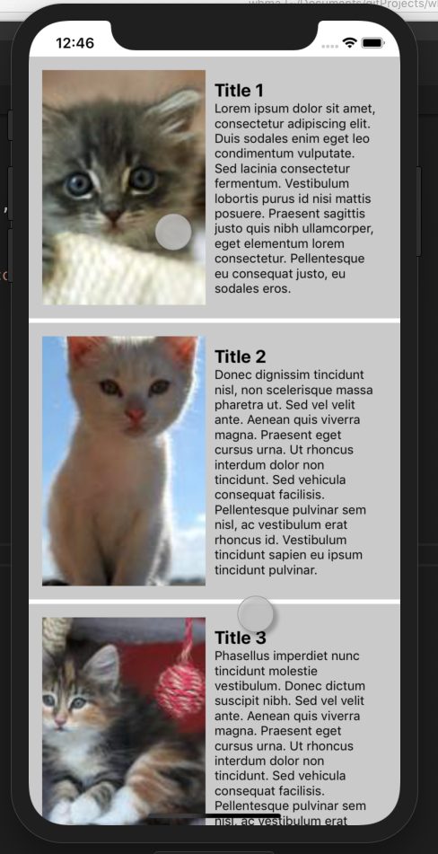

class: center, middle

# WBMA, First App

## 1/2019

---
# Exercise 1: Setup your toolchain and a new Ionic project

**a.**

Check: [Ionic docs](https://ionicframework.com/getting-started#cli)

1. If needed, install code editor (+ extensions), git, npm
1. Install Ionic `npm install -g ionic`
1. If you want to use iOS, install ios-deploy `npm install -g ios-deploy`
    - you can also add  application pakage name: `--id com.mycompany.myapp`
1. Use the `ionic` cli tool to generate a _blank_ app skeleton `ionic start myFirstApp blank --type=ionic-angular`
   1. Answer no to 4.0 and appflow suggestions 
1. Test that app works, run it with `ionic <command>` and open in browser
   - `cd myFirstApp`
   - `ionic serve`
1. Create a remote git repository and push your app there

**b.**  
1. Install TSlint to your project `npm i -D tslint tslint-ionic-rules` 
1. [Enable TSLint in your project](https://www.jetbrains.com/help/webstorm/tslint.html)
   - tslint.json contents:
   ```json
   {
     "defaultSeverity": "warning",
     "extends": "tslint-ionic-rules",
     "jsRules": {},
     "rules": {
       "no-duplicate-variable": true,
       "no-floating-promises": {
         "severity": "error"
       },
       "promise-function-async": true,
       "no-unused-variable": [
         true
       ],
       "no-var-requires": false
     },
     "rulesDirectory": [
       "node_modules/tslint-eslint-rules/dist/rules"
     ]
   }
   ```
1. Run `npm run lint` and fix possible errors in your code.
1. You can edit settings/editor/code style/typescript to correct code automatically with ctr-alt-l
1. Test on emulator
   - `ionic cordova emulate android -lc`
   - `ionic cordova emulate ios -lc`
1. If you run into problems
   1. run `ionic cordova requirements`
   1. fix the unmet requirements
      - Wrong android emulator fix:
         - Android studio  Preferences... > Appearance & Behavior > System Settings > Android SDK > SDK Platform
      - iOS emulator problem fix:
         - edit scripts in package.json:
         ```json
            "scripts": {
              "start": "ionic-app-scripts serve",
              "clean": "ionic-app-scripts clean",
              "build": "ionic-app-scripts build",
              "lint": "ionic-app-scripts lint",
              "emulate-live": "ionic cordova emulate ios -lc --debug --target=\"iPhone-X\" -- --buildFlag=\"-UseModernBuildSystem=0\"",
              "emulate-live-iPhone-8-Plus": "ionic cordova emulate ios -lc --target=\"iPhone-8-Plus\" -- --buildFlag=\"-UseModernBuildSystem=0\"",
              "emulate": "ionic cordova emulate ios --target=\"iPhone-X\" -- --buildFlag=\"-UseModernBuildSystem=0\"",
              "build-prod": "ionic cordova build ios --prod --release -- --buildFlag=\"-UseModernBuildSystem=0\"",
              "device": "ionic cordova run ios -- --buildFlag=\"-UseModernBuildSystem=0\""
            }            
         ```
         - use e.g `npm run emulate-live` to start emulator
      - Mac OS Java or Android Studio not found:
         - `sudo nano ~/.bash_profile`
         - add 
         ```text
            export JAVA_HOME=$(/usr/libexec/java_home -v 1.8)
            export ANDROID_SDK_ROOT=/Users/[your_username_here]/Library/Android/sdk
            export PATH=$ANDROID_SDK_ROOT/emulator:$ANDROID_SDK_ROOT/platform-tools:$PATH
         ```
         - `source .bash_profile`
      - Gradle not found
         - [install gradle](https://gradle.org/install/)

**c.**

1. Develop your app further. Add a list to the app skeleton so that the layout is similar to this: 

1. Develop your app further. Make the list dynamically by using this array and *ngFor:
    ```typescript
    // add this to home.ts before @Component
    class Pic {
      constructor(
        public title: string,
        public details: string,
        public thumbnail: string,
        public original: string,
      ) {
      }
    
    }
    
    // add this to HomePage component
    picArray: Pic[] = [
        {
          'title': 'Title 1',
          'details': 'Lorem ipsum dolor sit amet, consectetur adipiscing elit. Duis sodales enim eget leo condimentum vulputate. Sed lacinia consectetur fermentum. Vestibulum lobortis purus id nisi mattis posuere. Praesent sagittis justo quis nibh ullamcorper, eget elementum lorem consectetur. Pellentesque eu consequat justo, eu sodales eros.',
          'thumbnail': 'http://placekitten.com/310/302',
          'original': 'http://placekitten.com/2048/1920',
        },
        {
    
          'title': 'Title 2',
          'details': 'Donec dignissim tincidunt nisl, non scelerisque massa pharetra ut. Sed vel velit ante. Aenean quis viverra magna. Praesent eget cursus urna. Ut rhoncus interdum dolor non tincidunt. Sed vehicula consequat facilisis. Pellentesque pulvinar sem nisl, ac vestibulum erat rhoncus id. Vestibulum tincidunt sapien eu ipsum tincidunt pulvinar. ',
          'thumbnail': 'http://placekitten.com/321/300',
          'original': 'http://placekitten.com/2041/1922',
        },
        {
          'title': 'Title 3',
          'details': 'Phasellus imperdiet nunc tincidunt molestie vestibulum. Donec dictum suscipit nibh. Sed vel velit ante. Aenean quis viverra magna. Praesent eget cursus urna. Ut rhoncus interdum dolor non tincidunt. Sed vehicula consequat facilisis. Pellentesque pulvinar sem nisl, ac vestibulum erat rhoncus id. ',
          'thumbnail': 'http://placekitten.com/319/301',
          'original': 'http://placekitten.com/2039/1920',
        },
      ];
    ```
1. Develop your app further. Open 'original' image when 'view'-button is clicked.
   - Use [PhotoViever](https://ionicframework.com/docs/native/photo-viewer/) plugin to display the selected image
   ```sh
    ionic cordova plugin add com-sarriaroman-photoviewer@1.1.18
    npm install --save @ionic-native/photo-viewer@4
    ```
    - In home.html add (click)-event which calls for your own made method that starts PhotoViewer 
    - Ionic Native Plugins are providers, so you have to add PhotoViewer as a provider to app.module.ts
    - Needs to be run with emulator
    - Result:
    
    
1. Develop your app further. Add content (text, images) and more CSS.
1. git add, commit & push to remote repository 

---
