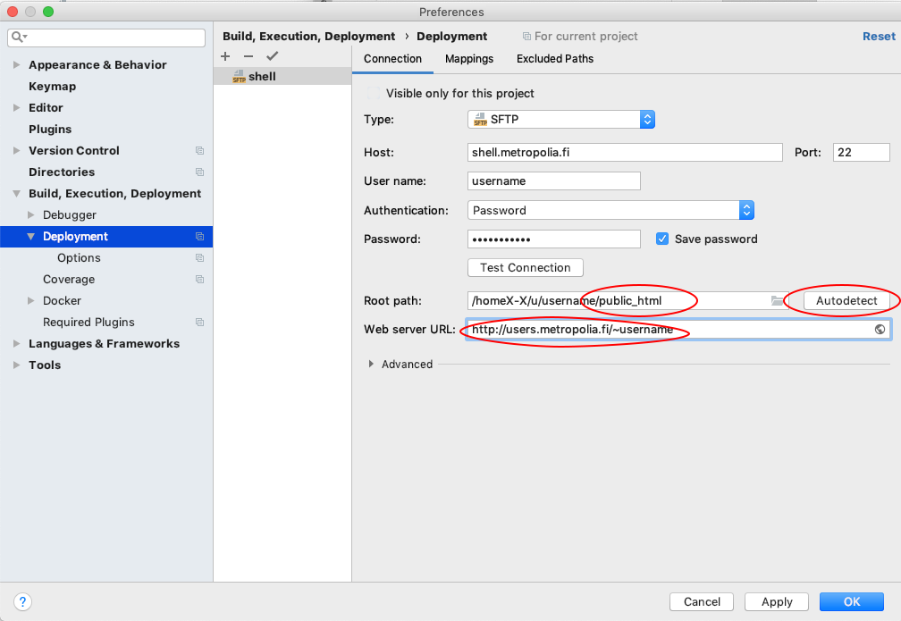
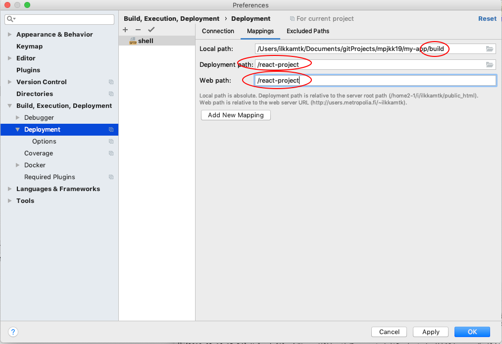
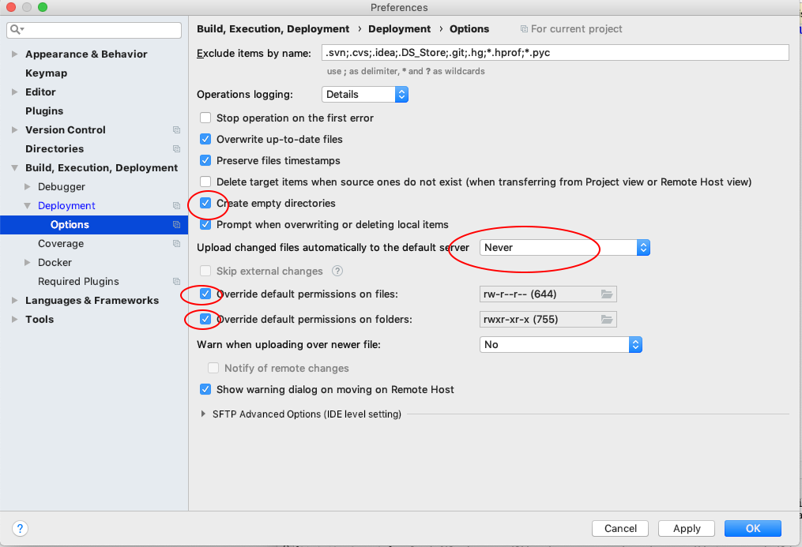

class: center, middle

# WBMA, First App

## 1/2019

---
# Exercise 1: Setup your toolchain and a new React Native project

Study [Getting started and Learn the basics](https://facebook.github.io/react-native/docs/getting-started) from React Native documentation

### Exercise

**a.**

1. If needed, install code editor (+ extensions), git, npm
1. Use the `Expo` cli tool to generate an app skeleton
    * create a folder for your React Native projects
    * use Git Bash or terminal to go to this folder `cd foldername/otherfoldername/etc...`
    * `npm install -g expo-cli`
    * `expo init MyApp`
        * choose 'blank' template
1. Test that app works; run it and open in browser
   - `cd MyApp`
   - `npm start`
1. Create a remote git repository and push your app there

**b.**  
1. Install ESlint to your project `npm i --save-dev eslint eslint-plugin-react eslint-plugin-react-native`
1. Initialize ESlint: `./node_modules/.bin/eslint --init` or `node node_modules\eslint\bin\eslint.js --init`
    * Choose:
        1. To check syntax, find problems, and enforce code style
        1. JavaScript modules (import/export)
        1. React 
        1. Browser
        1. Use a popular style guide
        1. Google
        1. JavaScript
        1. Y
1. Modify .eslintrc.js:
   ```JavaScript
    module.exports = {
      'env': {
        'browser': true,
        'es6': true,
      },
      'extends': [
        'google',
        'eslint:recommended',
        'plugin:react/recommended',
      ],
      'globals': {
        'Atomics': 'readonly',
        'SharedArrayBuffer': 'readonly',
      },
      'parserOptions': {
        'ecmaFeatures': {
          'jsx': true,
        },
        'ecmaVersion': 2018,
        'sourceType': 'module',
      },
      'plugins': [
        'react',
        'react-native'
      ],
      'rules': {
        'react/jsx-uses-react': 'error',
            'react/jsx-uses-vars': 'error',
            'no-console': 0,
            'require-jsdoc': 0,
      },
      'settings': {
        'react': {
          'createClass': 'createReactClass', // Regex for Component Factory to use,
                                             // default to "createReactClass"
          'pragma': 'React',  // Pragma to use, default to "React"
          'version': 'detect', // React version. "detect" automatically picks the version you have installed.
                               // You can also use `16.0`, `16.3`, etc, if you want to override the detected value.
                               // default to latest and warns if missing
                               // It will default to "detect" in the future
          'flowVersion': '0.53', // Flow version
        },
        'propWrapperFunctions': [
          // The names of any function used to wrap propTypes, e.g. `forbidExtraProps`. If this isn't set, any propTypes wrapped in a function will be skipped.
          'forbidExtraProps',
          {'property': 'freeze', 'object': 'Object'},
          {'property': 'myFavoriteWrapper'},
        ],
        'linkComponents': [
          // Components used as alternatives to <a> for linking, eg. <Link to={ url } />
          'Hyperlink',
          {'name': 'Link', 'linkAttribute': 'to'},
        ],
      },
    };
   ```
1. You can correct code automatically with shift-alt-f
1. Fix curly-braces error in Preferences/Settings
    * search for braces and uncheck all 'Insert space after...' checkboxes
1. Convert the App function to arrow function:
    ```jsx
   import React from 'react';
   import {StyleSheet, Text, View} from 'react-native';
   
   const App = () => {
     return (
       <View style={styles.container}>
         <Text>Open up App.js to start working on your app!</Text>
       </View>
     );
   };
   
   const styles = StyleSheet.create({
     container: {
       flex: 1,
       backgroundColor: '#fff',
       alignItems: 'center',
       justifyContent: 'center',
     },
   });
   
   export default App;
   ```

**c.**

1. Develop your app further. Add a `<table>` to the app skeleton so that the layout is similar to this: 

    

1. You can use placekitten.com or similar site for the images
1. Example html:
    ```html
    <table>
        <tbody>
           <tr>
               <td>
                   
                </td>
               <td>
                   <h3>Title</h3>
                   <p>Lorem ipsum dolor sit amet...</p>
               </td>
               <td>
                   <a href="#">View</a>
                </td>
             </tr>
        </tbody> 
    </table>

    ```

**d.**

1. Develop your app further. Make the table dynamically by using this array:
    ```javascript
    // add to App.js
      
    state = {
        picArray: [
          {
            'title': 'Title 1',
            'description': 'Lorem ipsum dolor sit amet, consectetur adipiscing elit. Duis sodales enim eget leo condimentum vulputate. Sed lacinia consectetur fermentum. Vestibulum lobortis purus id nisi mattis posuere. Praesent sagittis justo quis nibh ullamcorper, eget elementum lorem consectetur. Pellentesque eu consequat justo, eu sodales eros.',
            'thumbnails': {
              w160: 'http://placekitten.com/160/161',
            },
            'filename': 'http://placekitten.com/2048/1920',
          },
          {
    
            'title': 'Title 2',
            'description': 'Donec dignissim tincidunt nisl, non scelerisque massa pharetra ut. Sed vel velit ante. Aenean quis viverra magna. Praesent eget cursus urna. Ut rhoncus interdum dolor non tincidunt. Sed vehicula consequat facilisis. Pellentesque pulvinar sem nisl, ac vestibulum erat rhoncus id. Vestibulum tincidunt sapien eu ipsum tincidunt pulvinar. ',
            'thumbnails': {
              w160: 'http://placekitten.com/160/162',
            },
            'filename': 'http://placekitten.com/2041/1922',
          },
          {
            'title': 'Title 3',
            'description': 'Phasellus imperdiet nunc tincidunt molestie vestibulum. Donec dictum suscipit nibh. Sed vel velit ante. Aenean quis viverra magna. Praesent eget cursus urna. Ut rhoncus interdum dolor non tincidunt. Sed vehicula consequat facilisis. Pellentesque pulvinar sem nisl, ac vestibulum erat rhoncus id. ',
            'thumbnails': {
              w160: 'http://placekitten.com/160/163',
            },
            'filename': 'http://placekitten.com/2039/1920',
          },
        ],
      };

    ```

1. Create components for table, tbody and tr.
    * Hierarchy:
    ```text
    App
       -table
           -tbody
               -tr
               -tr
               ...
 
    ```
    * you can put each comoponent (table, tbody, tr) to one file or you can make own file for each component 
    * Pass picArray as props from App to table to tbody.
    * Iterate picArray in tbody to create multiple tr components
    
1. Develop your app further. Open 'filename' image when `<a>` is clicked.
1. (Optional) Develop your app further. Add more CSS. For example open 'filename' image to your self made modal.
1. git add, commit & push to remote repository
    * git checkout -b 'oksan-nimi'
    * git add .
    * git commit -m 'viesti'
    * git push
1. Deploy project to your public_html (see below for instructions)

---

## Deploy React Project

1. Add following to package.json (e.g after devDependencies):
    ```json
     "homepage": "."
    ```
1. Run `yarn build` or `npm run build`
1. Set deployment settings in WebStorm:
    
    
    
1. Move build folder to your public_html