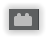
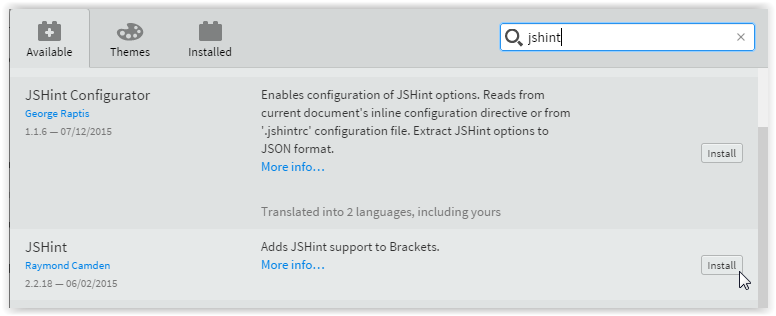
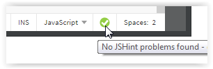

class: center, middle

# (Mobile) Web Development Toolchain


## MP 1/2016

---

# Contents

- Editor/IDE: Brackets (or any)
- Run, test & debug: Chrome browser      
- Version Control System: Git
- Package managers: NPM & Bower
- Building & automating tasks: Grunt
- Development frameworks: AngularJS, Bootstrap
- Creating a native (hybrid) app: Cordova

---

# Code editor or IDE

Ultimately, it's your choice. Brackets is recommended.

## Brackets

- free & open source code editor
- live preview in browser & integrated web server
- wide plugin support
- developed for web development

#### Other picks

- WebStorm
  - free student license
  - full featured IDE
  - based on IntelliJ IDEA, just like Android Studio
- Atom.io
- IDEs like: Eclipse, NetBeans... 

---

# Browser

- Chrome & [Chrome DevTools](https://developer.chrome.com/devtools) (Brackets Live Preview support)
      


---

# Package Management

## [NPM](https://www.npmjs.com/) - node.js package manager

- Install node.js to get the package manager npm
- npm packages needed in a project (dependencies) are stored in the `package.json` file
- locally installed (=project specific) packages are downloaded to `node_modules/` folder

## [Bower](http://bower.io/) 

- is installed using npm
- Package manager for web:
  - web/css frameworks
  - js libraries
- required dependencies are stored in the `bower.json` file
- packages are downloaded to `bower_components/` folder

???
      
package installation folders should be excluded from version control

---

# Example package.json

```js
{
  "name": "my-application",
  "version": "0.1.0",
  "devDependencies": {
    "grunt": "~0.4.5",
    "grunt-contrib-uglify": "~0.5.0"
  }
}

```

---

# Example bower.json

```js
{
  "name": "app-name",
  "version": "0.0.1",
  "author": "developerName",
  "license": "ISC",
  "dependencies": {
    "modernizr": "~2.6.2",
    "jquery": "~1.10.2"
  }
}
```

---

# Automating Development Tasks

Run frequent routine tasks in development workflow easily using
[Grunt](http://gruntjs.com/) & Gruntfile.js (like make & makefile in C)

- Run tests
- Validate code
- Build/Deploy application
  - Minify JS & CSS files
  - Remove comments
  - Choose, copy & rename files 

---

# Example Gruntfile.js


```js
module.exports = function(grunt) {

  // Project configuration.
  grunt.initConfig({
    pkg: grunt.file.readJSON('package.json'),
    uglify: {
      options: {
        banner: '/*! <%= pkg.name %> <%= grunt.template.today("yyyy-mm-dd") %> */\n'
      },
      build: {
        src: 'src/<%= pkg.name %>.js',
        dest: 'build/<%= pkg.name %>.min.js'
      }
    }
  });

  // Load the plugin that provides the "uglify" task.
  grunt.loadNpmTasks('grunt-contrib-uglify');
  // Default task(s).
  grunt.registerTask('default', ['uglify']);
};

```

---
        
# Frameworks used

## Layout/HTML/CSS

[Bootstrap](http://getbootstrap.com/)
- Layout & UI components, widgets

## Front-end application logic

[AngularJS](https://angularjs.org/)


???

TBD: App arch img

---

# Source Code Management

Check [Git stuff](https://github.com/mattpe/git-intro/blob/master/git-basics.md) from previous course.

What files to include in repo?

- all source code
- README.md and other documentaion
- grunt, bower & npm settings files
- .gitignore file: to exclude stuff not to be included

Exclude:

- IDE specific project files & folders
- build targets
- packages managed by npm or bower 
- any temp & OS specific files, like Apple's `.DS_Store` 


---

# From web page to native app

## Hybrid App

- Written in HTML/CSS/JS
- Wrapped to native app using packaging tool
- [Apache Cordova](https://cordova.apache.org/)
  - Create mobile apps with HTML, CSS & JS
- [Ionic Framework](http://ionicframework.com)
  - uses Cordova for building
  - utilizes Angular for application logic
  - has it's own HTML/CSS components

---

class: center, middle

# Getting Started with Brackets

---
        
# Install the Editor

Download & install: [Brackets.io](http://brackets.io/)
        
.center[]

---

# Install Extensions

Open then Extension Manager by clicking a button  on the right. Search for the JSHint plugin (by Raymond Camden) and install it and the Configurator plugin as well.

[JSHint](http://jshint.com/about/) is a code analysis (linting) tool that helps you to write better code.

 

---
        
## Install Extensions 2        

Other useful (& optional) plugins:
        
- JSHint Configurator is a tool to help setting up file specific JSHint options

- [Brackets Git](https://github.com/zaggino/brackets-git) plugin provides Git integration (you should still be familiar with the command line git as well)

- [Beautify](https://github.com/drewhamlett/brackets-beautify) for automatic code formation 

- Some Angular plugin e.g. https://github.com/angular-ui/AngularJS-brackets


---

# Configure JSHint

To disable built-in JSLint & to enable JSHint:
- open `brackets.json` settings file _Debug -> Open Preferences File_ (Default location in Windows: `C:\Users\yourUserName\AppData\Roaming\Brackets\brackets.json` )
- Add following lines on top in the file: 

```js
{
  "language": {
      "javascript": {
          "linting.prefer": ["JSHint"],
          "linting.usePreferredOnly": true
      }
  },
  "jshint.globals": {
      "angular": true,
      "module": true,
      "document": true
  },
....
```
        
    
---

# Brackets - Basic Usage

Active **project** is the folder open on the left side panel (_File -> Open folder..._) 
        
**Live Preview** , `Ctrl-ALt-P`: Open current html page in a browser. Brackets creates a local web server and keeps track of changes automatically.

When testing in browser, using local web server (URL eg. `https://127.0.0.1:[port]/yourFile.html`) instead of direct file access (eg. `file://C:\users\yourname\codefolder\yourFile.html`) makes development easier especially with networking tasks in JS.  

**Inline Editing** provides a quick access to modify CSS files directly from HTML. Just place cursor in tag, class or id and press `Cmd/Ctrl-E`.

In the bottom left corner of the editor are located functionalities to switch between tabs and spaces, set indentation and check JSHint errors.       



---

# Exercise 1: Setup your toolchain and a new web project

1. Install missing tools listed in the previous slides (Brackets, Chome, Git, Node)
2. Configure Brackets & JSHint
3. Use npm to install [grunt-cli](http://gruntjs.com/getting-started) & [bower](http://bower.io/) **globally** `npm install -g <application>` 
   - Windows: use Git Bash command line
   - Mac/Linux: use console/terminal
   - [npm no sudo fix for Mac/Linux](https://github.com/sindresorhus/guides/blob/master/npm-global-without-sudo.md)
5. Create a folder for your project
6. Create app skeleton folders & files:
    - _src_ folder for dev html/css/js files
    - _build_ folder for deployment ready application
    - _.gitignore_ file including appropriate contents 
    - _[package.json](https://docs.npmjs.com/files/package.json)_: install dev-dependencies: bower, grunt & grunt plugins, use `--save-dev` option with `npm`
    - _[bower.json](http://bower.io/docs/creating-packages/#bowerjson)_: install angular, bootsrap & jquery, use `--save` option with `bower`   
    - _[Gruntfile.js](http://gruntjs.com/getting-started)_: Tasks: copy & minify _src/app.js_ file to _build/app.min.js_, check code with jshint
    - add a simple html template and js file into _src/_ folder
7. Test that libraries installed by bower are accessible in your html
8. Test that `grunt` is working
9. Create git repo: `git init` and a remote repository (Github/Bitbucket)
10. Add remote repo to your local git conf: `git remote add origin [remoteURL]` 
11. Add & commit files to your local repo (`git add/commit`)
12. Push local master branch to remote repo: `git push -u origin master`  
13. Return a link pointing to your repo (needs to be public or shared to teachers)

Ask help if you got lost!


---

## Useful online material

### Angular

- Start from here: http://campus.codeschool.com/courses/shaping-up-with-angular-js/
- https://www.codecademy.com/learn/learn-angularjs
- https://docs.angularjs.org/tutorial
- https://docs.angularjs.org/guide

### Bootstrap

- http://www.w3schools.com/bootstrap/
- https://www.codecademy.com/en/skills/make-a-website/topics/bootstrap-components/bootstrap-intro


