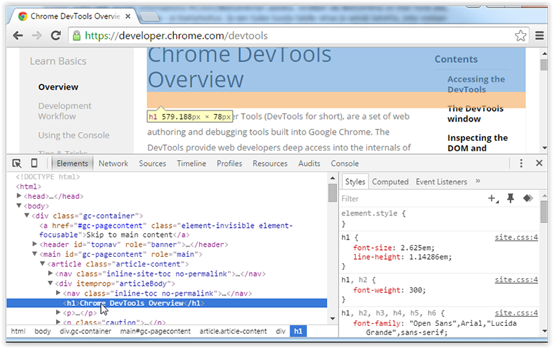

class: center, middle

# Toolchain

## 1/2019

---

# Contents

- Editor/IDE: WebStrom/PhpStorm, Visual Studio Code, (or any)
- Language: JavaScript (ES6 ->)
- Run, test & debug: Chrome browser dev tools, Safari browser dev tools
- Version Control System: Git
- Package manager: NPM or Yarn
- Building & automating tasks: Create React App
- Development frameworks: React
- (Optional) Creating a mobile app: React Native

---

# Code editor or IDE

Ultimately, it's your choice. WebStrom/PhpStorm is recommended.

#### WebStorm/PhpStorm

- free for Metropolia students. [Apply for license here](https://www.jetbrains.com/student/)
  - _@metropolia.fi_ email address needed for a free license
- full featured IDE
- quite ready out of the box. No need for plugins.
- based on IntelliJ IDEA, just like Android Studio

#### Visual Studio Code

- free & open source code editor by Microsoft (**!=** Visual Studio IDE)
- wide extension support
- lightweight, multiplatform support
- good [docs & instructions](https://code.visualstudio.com/docs/editor/codebasics)
- choice of many Angular developers

#### Other picks

- [Atom](https://atom.io/)
- [Brackets](http://brackets.io/)
- Other IDEs like: IntelliJ Ultimate IDEA, Eclipse, NetBeans... 

---

# Browser & debugging

- Chrome & [Chrome DevTools](https://developers.google.com/web/tools/chrome-devtools/)
- Safari & [Safari Develop menu](https://support.apple.com/guide/safari/use-the-developer-tools-in-the-develop-menu-sfri20948/mac)



---

# Source Code Management - Git

Check [Git stuff](https://github.com/mattpe/git-intro/blob/master/git-basics.md)

What files to include in repo?

- all source code
- README.md and other documentation
- eg. npm grunt or bower settings files
- .gitignore file: list of local stuff not to be included in the version control ->

Exclude:

- IDE specific project files & folders (.idea)
- build targets and other automatically generated files
- packages managed e.g. by npm or bower (= _node_modules/_ & _bower_components/_ folders) 
- any temp & OS specific files, like Apple's `.DS_Store` 

Create React App generates a .gitignore file automatically. Add .idea manually.

---

# Package Management

## [NPM](https://www.npmjs.com/) - Node.js Package Manager

- Install [node.js](https://nodejs.org/en/) to get the package manager **npm**
- npm packages needed in a project (dependencies) are listed in the `package.json` file and can be install with `npm install` command
- locally installed (=project specific) packages are downloaded to `node_modules/` folder (should be excluded from version control)

#### OS X no sudo

- [instructions](https://github.com/sindresorhus/guides/blob/master/npm-global-without-sudo.md)

#### NPM Alternative

[Yarn](https://yarnpkg.com/) 

- newcomer gaining a lot of traction now
- first [open source release on October, 2016](https://code.facebook.com/posts/1840075619545360). Current version 0.18.1 
- uses same package.json file and npm registry as npm
- claimed to be faster, more secure and reliable

---

# Example package.json

```javascript
{
  "name": "example-app",
  "version": "0.0.1",
  "author": "Example Coder <ecoder@example.com>",
  "description": "An example app doing something",
  "license": "MIT",
  "scripts": {
    "start": "node ./app.js"
  },
  "dependencies": {
    "@angular/common": "~2.1.0",
    "@angular/core": "~2.1.0"
  }        }
}

```

---