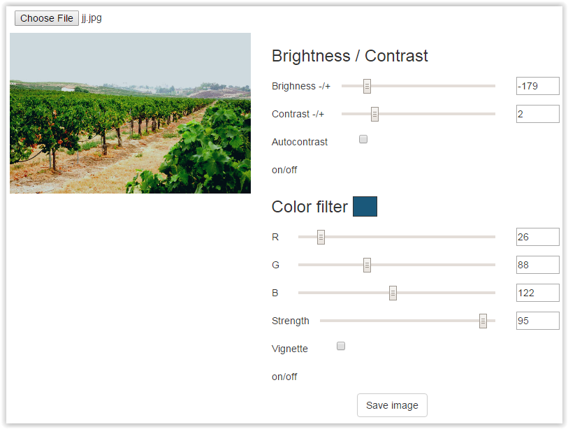

# Angular image editor exercise



### Starting point

Clone repo from: https://github.com/ilkkamtk/imageEditor-start/

Install dependencies listed in _package.json & bower.json_: `npm install && bower install`

[Ruby](https://www.ruby-lang.org/en/) is needed to install compass: `[sudo] gem install compass`

### Step 1 (Wednesday)

**TODO:** 

- Open an image file on editor and draw it on canvas
- Bind input values to controller's scope 

Example solution: https://github.com/ilkkamtk/imageEditor-start/tree/1st-step

It's a new branch in the same repo. You can fethch the new branch to your local (already cloned) repository using git:

```sh
# cd to project directory
# first save your own local changes
git add .
git commit -m "my changes"

# pull new stuff from server:
git pull
# activate the fetched branch
git checkout 1st-step 

```
 
### Step 2 (Thursday)

**TODO**:

- fix image ratio -> use image size as canvas size
- Add functionality to brightness & contrast sliders 
   - create a new function to scope
   - read the pixels of an image and change the values one by one
   - update canvas

**tip**: http://code.tutsplus.com/tutorials/canvas-from-scratch-pixel-manipulation--net-20573

Example solution: https://github.com/ilkkamtk/imageEditor-start/tree/2nd-step

### Step 3 (Friday)

**TODO**: Finalize it!

- Add a color box for viewing the filter color
  - use angular attribute directive `ng-attr-style="<css-stuff>"` and expressions to apply css styles to span element in html
  - use slider values to control css color
- Create tint method and bind it to the strength slider
  - use values of color sliders and strength slider to modify pixel values of the image (like brightness & contrast filters)
- Create a vignette method and bind it to the correct checkbox in html
  - read and use pixel values of vignette image (in _images_ folder) to modify pixel values of the editable image
- Add a save image link url (html) and functionality (to controller)

- EXTRA: Autocontrast functionality

