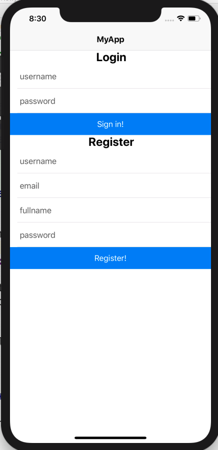
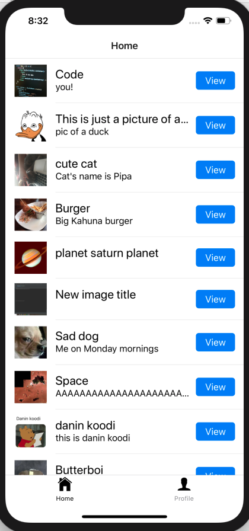
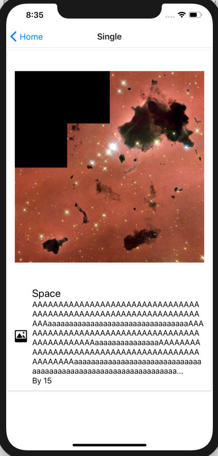
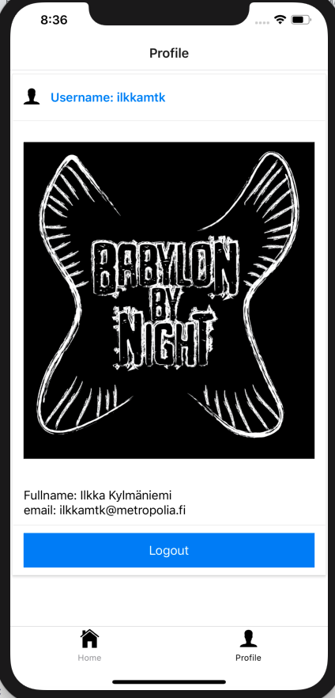

class: center, middle

# NativeBase

## 3/2020

---
  **Note!**

  When using NativeBase you should import the [`<Image>` component](https://facebook.github.io/react-native/docs/images.html#network-images) still from `react-native` library to avoid issues with network sourced images.


### Task A: Convert the app we've made so far to use NativeBase

1. Continue last exercise. Create a new branch with git.  
1. Study [this article](https://blog.bitsrc.io/11-react-native-component-libraries-you-should-know-in-2018-71d2a8e33312) and [NativeBase](https://nativebase.io/)
1. Convert the app we've made so far to use NativeBase
1. Install NativeBase
    - `npm install native-base --save`
    - `expo install expo-font`
1. Remove all styling from the files where you use NativeBase components:

   ```jsx harmony
   // remove this part:
   const styles = StyleSheet.create(...
   ```

    - You can customise NativeBase components later
1. [NativeBase components](https://docs.nativebase.io/Components.html#Components)
   - Some components you may find useful for the task: `Body`, `Button`, `Card`, `CardItem`, `Container`, `Content`, `Header`, `Icon`, `List`, `ListItem`, `Left`, `Right`, `Thumbnail`, `Text`, `Title`...    
   - By default you can use [Ionicons](https://ionicons.com/) as value for name attribute of [Icon](https://docs.nativebase.io/Components.html#icon-def-headref)
1. In our app there are already `List` and `ListItem` components so if you want to use the [List](https://docs.nativebase.io/Components.html#list-def-headref) (and ListItem) component of NativeBase you need to use `import as` syntax:

   ```jsx harmony
   ...
   import {List as BaseList} from 'native-base';
   ...
   return (
         <BaseList
           dataArray={media}
           renderRow={
             (item) => <ListItem
               navigation={props.navigation}
               singleMedia={item}
             />
           }
           keyExtractor={(item, index) => index.toString()}
         />
     );
   ```
   
   **Note:** native-base `List` uses a different prop name for data array than react-native `FlatList`: Change `data` -> `dataArray` 

1. Adding icons to bottom tabs

   ```jsx harmony
   // Navigator.js
   /* eslint-disable react/display-name */
   import React from 'react';
   ...
   const TabNavigator = createBottomTabNavigator(
        {
          Home,
          Profile,
        },
        {
          defaultNavigationOptions: ({navigation}) => ({
            tabBarIcon: () => {
              const {routeName} = navigation.state;
              let iconName;
              if (routeName === 'Home') {
                iconName = 'home';
              } else if (routeName === 'Profile') {
                iconName = 'person';
              }

              // You can return any component that you like here!
              return <Icon
                name={iconName}
                size={25}
              />;
            },
          }),
        }
    );
    ...
   ```

1. In Android devices you need to [load the NativeBase fonts](https://docs.nativebase.io/docs/GetStarted.html) ([example](https://github.com/GeekyAnts/NativeBase-KitchenSink/blob/CRNA/src/boot/setup.js)) before you can use them. It can be done by using useEffect hook in the _App.js_:

```jsx harmony
import React, { useState, useEffect } from 'react';
import {MediaProvider} from './contexts/MediaContext';
import Navigator from './navigators/Navigator';
import * as Expo from "expo";
import * as Font from 'expo-font';

const App = () => {
  const [fontReady, setFontReady] = useState(false);
  const loadFonts = async () => {
    await Font.loadAsync({
      Roboto: require("native-base/Fonts/Roboto.ttf"),
      Roboto_medium: require("native-base/Fonts/Roboto_medium.ttf"),
    });
    setFontReady(true);
  }
  useEffect(() => {
   loadFonts();
  }, []);

  if (!fontReady) {
    console.log('Waiting for fonts...');
    return (
      <Expo.AppLoading />
    );
  }

  return (
    <MediaProvider>
      <Navigator></Navigator>
    </MediaProvider>
  );
};

export default App;

```
1. Try to make the app look like these images:








### Task B: Develop profile page

1. Add avatar image to the user
    - Use postman to upload image and add a [tag](http://media.mw.metropolia.fi/wbma/docs/#api-Tag-PostTag) 'avatar_CurrentUserId' to it (e.g avatar_85)
    - When fetching avatars, you can use _CurrentUserId to limit the amount of fetched data.
1. Display users avatar image, name and email in profile page
   - You'll need to use existing or add more methods to 'ApiHooks.js' to achieve this
   - Hint: Userdata is already in AsyncStorage


  
