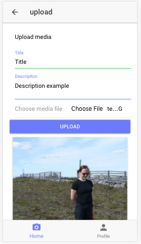
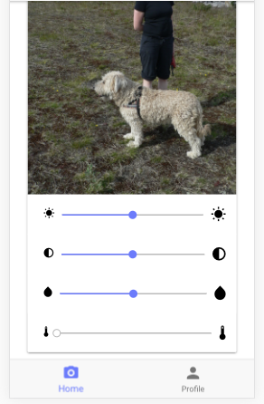

class: center, middle

# WBMA, Forms + Upload

## 4/2019

---

# Forms

### Task A: Create Upload Form 

1. Continue the previous exercise. Create a new git branch for these tasks.
1. Create a new file Upload.js  to views folder for the upload functionality
    - add normal HTML form (don't use Material UI at this point)
    - add input fields for 'title' (type=text), 'description' (textarea) and 'file' (type=file)
    - accept only media files to file input
    - add title and description to state (like in Login.js)
1. Add a button to Nav to navigate to UploadPage
1. When uploading a file to the API, you need to send [FormData](https://developer.mozilla.org/en-US/docs/Web/API/FormData/Using_FormData_Objects) 
    - in Upload.js create a method which is called by (change) event of the file input element. In the function use `evt.persist()`to keep the original synthetic event. Then use `evt.target.files`-array to get the selected file. Save the file (first item of the array) to state. 
    - create another method to upload the file. create new FormData object, append the file, title and description from state to the FormData object and send it to the API using [fetch](https://muffinman.io/uploading-files-using-fetch-multipart-form-data/).
    - Add [CircularProgress](https://material-ui.com/demos/progress/) to show a spinner
    - After image is uploaded redirect to Home
        - wait 2 seconds before going to Home so that thumbnail is ready
        - hide spinner
        - when back in Home, refresh image table
    - Add img element to Upload.js to show a preview of the selected media file
        - use [FileReader](https://developer.mozilla.org/en-US/docs/Web/API/FileReader) to add the image to src attribute as dataURL
        - if media is audio or video use some default image
    - Example:
    
    
        
### Task B: Use CSS filters to adjust the image
1. Study [CSS filters](https://css-tricks.com/almanac/properties/f/filter/)
1. Add [Slider](https://material-ui.com/lab/slider/) elements to change brightness, contrast, saturation and sepia CSS filters
    - Read from [this link](https://material-ui.com/lab/about/) about installation.
1. Use [Inline Styles](https://react-cn.github.io/react/tips/inline-styles.html) to add filters to preview image
    - [Material-UI inline styles](https://material-ui.com/customization/overrides/#overriding-with-inline-style)
1. Save filter settings as JSON (JSON.strigify) as part of the description when file is uploaded
    
    
    * example JSON:
     ```json
           { 
           ...
              "description": "[d]Nice dog[/d][f]{\"brightness\":131,\"contrast\":110,\"warmth\":10,\"saturation\":90}[/f]",
           ...
           }
     ```
    * You can extract filters later like this:
    ```javascript
    const getFilters = (value) => {
        const pattern = '\\[f\\](.*?)\\[\\/f\\]';
            const re = new RegExp(pattern);
            // console.log(re.exec(value));
            try {
              return JSON.parse(re.exec(value)[1]);
            } catch (e) {
              return {
                brightness: 100,
                contrast: 100,
                warmth: 0,
                saturation: 100,
              };
            }
    }
   ```
1. Upload button should be activated only when the form is correctly filled
    - Title is required and minimun length is ?
    - Description is optional but minimun length is ?
    - Media file of correct type (image/video/audio) is required
1. Add reset button for clearing the whole form and image preview
    
1. If you have time, try to recreate [Instagram's Juno filter](https://tricky-photoshop.com/how-to-create-instagram-juno-effect-in-photoshop/)
    - instead of sepia filter, you need to create a [SVG-filter](https://css-tricks.com/gooey-effect/) to do the warming filter
    - [feColorMatrix generator](https://kazzkiq.github.io/svg-color-filter/)
